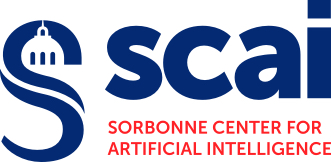
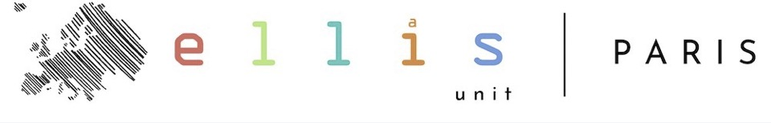
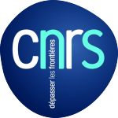

CVPR@Paris 2025 is a 1-day event that takes place June 6th 2025 in Paris. This event provides a local meeting prior to the <a href="https://cvpr.thecvf.com/">CVPR conference</a>. It aims at encouraging sustainability and inclusivity in Deep Learning and Computer vision research. All students and researchers are welcome to attend.

Authors of accepted papers at CVPR 2025, CVPR workshops, and recent international conference (ICLR 2025) are given the opportunity to present their work, through an oral presentation and/or a poster session. We may unfortunately not be able to accommodate all papers.

<h2>
  <a href="https://docs.google.com/forms/d/e/1FAIpQLSc694-5PLnDB8XEIE-QRK-8D-1YgV4Hl8IaBGWs0hOSQPOYDg/viewform?usp=dialog/" 
     style="text-decoration: none; color: inherit;">
    Registration
  </a>
</h2>

The event is free but registration is mandatory. Registration are open <a href="https://docs.google.com/forms/d/e/1FAIpQLSc694-5PLnDB8XEIE-QRK-8D-1YgV4Hl8IaBGWs0hOSQPOYDg/viewform?usp=dialog"> here</a>, priority will be given to authors presenting a paper.

## Venue

This event will take place in center Paris.

<!-- To access by metro, go to station Jussieu on the line 10. -->

<!---->

## Schedule 
The event is planned on June 6th.

| **Time** | **Description** |
| -----| ----------- |
| 09:30 AM - 10:00 AM | Coffe break and Opening |
| 10:00 AM - 10:45 AM | Keynote: Alexei A. Efros (UC Berkeley) |
| 11:00 AM - 12:30 PM | Poster Session 1 |
| 12:30 PM - 02:00 PM | Lunch break |
| 02:00 PM - 02:45 PM | Keynote: Diane Larlus (Naver Labs Europe)|
| 03:00 PM - 03:45 PM | Keynote: Alexandre Alahi (EPFL)|
| 04:00 PM - 05:30 PM | Poster Session 2 |

<!-- ### Scientific presentations
The presentations are divided into 6 thematic sessions, details are gathered <a href="docs/assets/Schedule_Talks.pdf"> here</a>. Each presentation will last 15 minutes. In the interest of time, questions should be deferred to the poster session. All oral presentations also have a poster presentation in the following poster session. -->

<!-- ## Sustainability ambitions

We aim to organize a local and sustainable alternative to in-person attendance to international ML conferences. To this aim:

- we strongly encourage participants to NeurIPS@Paris to travel to Paris by sustainable means.
- we offer fully vegeterian catering.
- we encourage participants to consider as much as possible not flying to the main NeurIPS conference.
 -->

## Committees

### General Chairs

<a href="https://cord.isir.upmc.fr/">Matthieu Cord</a> (Sorbonne University)  
<a href="https://vicky.kalogeiton.info/">Vicky Kalogeiton</a> (École Polytechnique, IP Paris)  
<a href="https://davidpicard.github.io/">David Picard</a> (École Nationale des Ponts et Chaussée, IP Paris)  

### Program Chairs

<a href="https://mustafashukor.github.io/">Mustafa Shukor</a> (Sorbonne University)  
<a href="https://raphael-baena.github.io/">Raphael Baena</a> (École des Ponts ParisTech, ENPC)  

<!-- 
### Advising committee

[Chloé-Agathe Azencott](https://cazencott.info/) (Mines Paris-PSL)  
[Francis Bach](https://www.di.ens.fr/~fbach/) (INRIA)  
[Claire Boyer](https://www.imo.universite-paris-saclay.fr/~claire.boyer/) (Université Paris-Saclay)  
[Gérard Biau](https://perso.lpsm.paris/~biau/) (Sorbonne Université) 
[Vianney Perchet](https://vianney.ai/) (Criteo, ENSAE)  
[Jean-Philippe Vert](https://members.cbio.mines-paristech.fr/~jvert/) (Owkin)  

## Sponsors

This event is supported by Apple, Bioptimus, Critéo, Google DeepMind, Owkin, [Probabl](https://probabl.ai).

This event is a part of the [ELLIS Pre-NeurIPS Fest 2024: Celebrate, Connect, Collaborate](https://ellis.eu/news/ellis-pre-neurips-fest-2024-celebrate-connect-collaborate).

 -->

## Contact

If you have any question, please contact us at [cvprinparis@gmail.com](mailto:neuripsinparis@gmail.com).

---

&nbsp;&nbsp; 
&nbsp;&nbsp;

