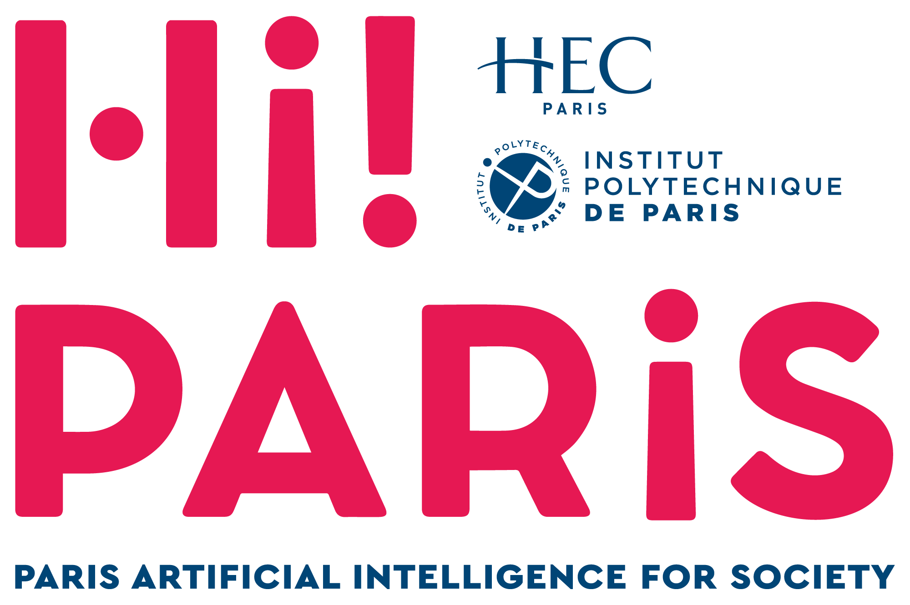

CVPR@Paris 2025 is a 1-day event that takes place in center Paris on the 6th of June 2025. This event provides a local meeting related to the <a href="https://cvpr.thecvf.com/">CVPR conference</a>. It aims at addressing some sustainability and inclusivity concerns in Deep Learning and Computer vision research. All students and researchers are welcome to attend.

Authors of accepted papersa t CVPR 2025, CVPR workshops, and recent international conference (ECCV 2024, Neurips 2024) are given the opportunity to present their work, through an oral presentation and/or a poster session. We unfortunately cannot accomodate oral presentations for all accepted papers; a subset of accepted papers will be proposed an oral presentation, based on scientific quality, thematic coherence and diversity criteria.

<h2>
  <a href="https://docs.google.com/forms/d/e/1FAIpQLSc694-5PLnDB8XEIE-QRK-8D-1YgV4Hl8IaBGWs0hOSQPOYDg/viewform?usp=dialog/" 
     style="text-decoration: none; color: inherit;">
    Registration
  </a>
</h2>

The event is free but registration is mandatory. Registration are open <a href="https://docs.google.com/forms/d/e/1FAIpQLSc694-5PLnDB8XEIE-QRK-8D-1YgV4Hl8IaBGWs0hOSQPOYDg/viewform?usp=dialog"> here</a>.

## Venue

This event will take place in Paris.

<!-- To access by metro, go to station Jussieu on the line 10. -->

<!---->

## Schedule 
The event is planned on June 6th.

It will feature oral presentations and poster sessions of CVPR 2025.

<!-- ### Scientific presentations
The presentations are divided into 6 thematic sessions, details are gathered <a href="docs/assets/Schedule_Talks.pdf"> here</a>. Each presentation will last 15 minutes. In the interest of time, questions should be deferred to the poster session. All oral presentations also have a poster presentation in the following poster session. -->

<!-- ## Sustainability ambitions

We aim to organize a local and sustainable alternative to in-person attendance to international ML conferences. To this aim:

- we strongly encourage participants to NeurIPS@Paris to travel to Paris by sustainable means.
- we offer fully vegeterian catering.
- we encourage participants to consider as much as possible not flying to the main NeurIPS conference.
 -->

## Committees

### General Chairs

<a href="https://cord.isir.upmc.fr/">Matthieu Cord</a> (Sorbonne University)  
<a href="https://vicky.kalogeiton.info/">Vicky Kalogeiton</a> (École Polytechnique, IP Paris)  
<a href="https://davidpicard.github.io/">David Picard</a> (École Nationale des Ponts et Chaussée, IP Paris)  

### Program Chairs

<a href="https://mustafashukor.github.io/">Mustafa Shukor</a> (Sorbonne University)  
<a href="https://raphael-baena.github.io/">Raphael Baena</a> (École des Ponts ParisTech, ENPC)  

<!-- 
### Advising committee

[Chloé-Agathe Azencott](https://cazencott.info/) (Mines Paris-PSL)  
[Francis Bach](https://www.di.ens.fr/~fbach/) (INRIA)  
[Claire Boyer](https://www.imo.universite-paris-saclay.fr/~claire.boyer/) (Université Paris-Saclay)  
[Gérard Biau](https://perso.lpsm.paris/~biau/) (Sorbonne Université) 
[Vianney Perchet](https://vianney.ai/) (Criteo, ENSAE)  
[Jean-Philippe Vert](https://members.cbio.mines-paristech.fr/~jvert/) (Owkin)  

## Sponsors

This event is supported by Apple, Bioptimus, Critéo, Google DeepMind, Owkin, [Probabl](https://probabl.ai).

This event is a part of the [ELLIS Pre-NeurIPS Fest 2024: Celebrate, Connect, Collaborate](https://ellis.eu/news/ellis-pre-neurips-fest-2024-celebrate-connect-collaborate).

 -->

## Contact

If you have any question, please contact us at [cvprinparis@gmail.com](mailto:neuripsinparis@gmail.com).

---

&nbsp;&nbsp;

